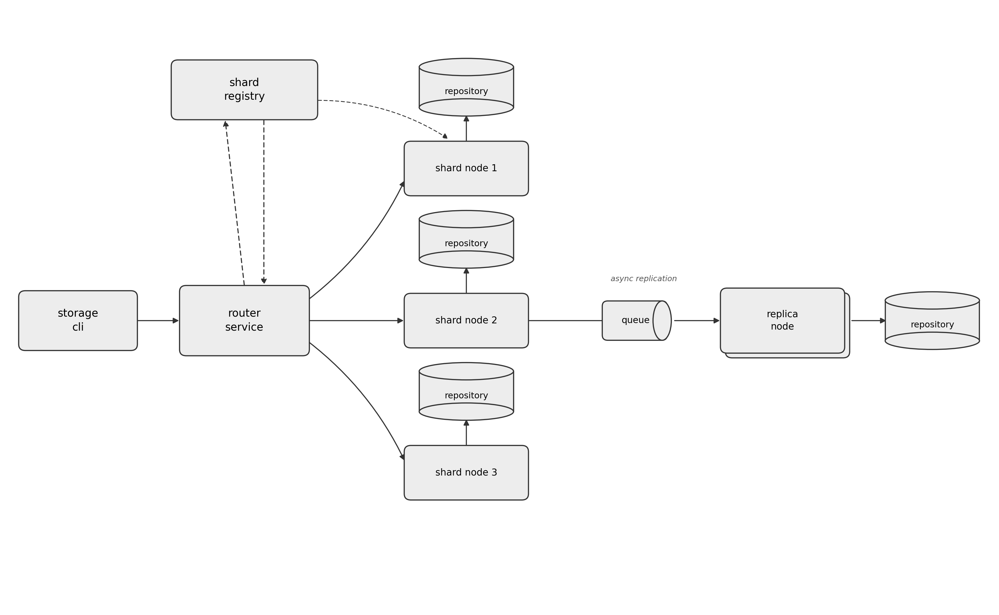

# storage-sharded-service

Our fictional company stores large volumes of key-based records (customer profiles, session data, usage logs) and a single database node is no longer enough: it cannot hold the full dataset, and it cannot serve the write/read throughput required. We are going to build a **horizontally sharded storage service** in Java + Spring Boot. Clients write and read records through a single entry point, a **router service**, which deterministically decides which **shard node** owns a given key and forwards the request there. Each shard node owns a disjoint partition of the key space and persists it in its own database. A **shard registry** keeps track of the current shard map and the health of each node, so the router always forwards to a live shard. In this first release we are also going to add a minimal **asynchronous replication** path: one shard publishes its write events to a queue, and a replica node consumes them to keep a redundant copy for durability.

## High Level Architecture

Solid arrows: synchronous request path (client → router → shard node → repository). Dashed arrows: shard-map lookup and node heartbeats between the router and the shard registry. The queue → replica node → repository chain on the right is the asynchronous replication path, shown off shard node 2 as the representative case — the same mechanism applies to every shard.

---

## Background

This is a small project to train your skills in Java and Spring Boot, and to get hands-on with a distributed-systems problem you will keep running into as a backend/Edge ML engineer: how do you split a dataset across multiple nodes without losing the ability to find a record later, and without every node needing to know about every other node's data? The goal is not to build a production-grade distributed database — it is to internalize the core mechanics (hashing, partition ownership, membership, replication) by implementing a deliberately small version of them yourself.

## Objectives

- Implement a **router service** that exposes a REST API for PUT / GET / DELETE by key and forwards each request to the correct shard node.
- Implement a **shard node** service (deployed as N independent instances) that owns a partition of the key space and persists records in its own database.
- Implement a **shard registry** that maintains the shard map (which node owns which partition) and tracks node health via heartbeats, so the router never forwards to a dead node.
- Implement a minimal **asynchronous replication** path from one shard to a replica node through a message queue, so a single node's disk is not the only copy of the data.
- Reason explicitly about trade-offs: why this partitioning scheme over the alternatives, what happens on node failure, what happens when you add or remove a shard.

## Functional Requirements

### Router service

- **PUT /records/{key}** — accepts a JSON body, computes the owning shard for _key_, forwards the write, returns 201 with the shard id that stored it.
- **GET /records/{key}** — resolves the owning shard and returns its current value, or 404 if absent.
- **DELETE /records/{key}** — resolves the owning shard and forwards the delete.
- **GET /shards/map** — returns the current shard map for debugging/inspection.
- On a shard node being unreachable, the router must retry against the registry's latest map once before failing the request (do not silently return stale data).

### Shard node

- Owns one partition of the key space; exposes internal read/write/delete endpoints the router calls.
- Persists records in its own database instance (one schema/instance per shard — no shared table).
- Registers itself with the shard registry on startup and sends periodic heartbeats.
- Publishes a write/delete event to the replication queue after a successful local commit.

### Shard registry

- Maintains the authoritative shard map: partition range/hash-slot ownership → node address.
- Accepts heartbeats; marks a node unhealthy after a configurable timeout and exposes that in the map.
- Serves the current map to the router on demand (poll or push — your choice, document which and why).

### Replica node

- Consumes events from the replication queue and applies them to its own repository.
- Replication is **best-effort and asynchronous** — the write to the primary shard must not wait on it.

## Sharding Strategy

Pick and justify one partitioning scheme before writing any code — this is the design decision the rest of the system depends on:

- **Modulo hashing** (`hash(key) % N`) — simplest to implement, but adding or removing a shard remaps almost every key, which means a full data reshuffle.
- **Consistent hashing with virtual nodes** — nodes and keys are placed on a hash ring; adding or removing a node only remaps the keys adjacent to it on the ring. More moving parts, but it is the scheme real sharded/distributed systems use, and it is the one this project expects you to implement.

Document, in your README, exactly how a key maps to a shard, how many virtual nodes per physical shard you use and why, and what happens to already-stored keys when you change the shard count — walk through it with a concrete example (e.g. 3 shards → 4 shards) rather than describing it only in the abstract.

## API Design (contract)

| Method | Path                         | Description                     | Response                                         |
| ------ | ---------------------------- | ------------------------------- | ------------------------------------------------ |
| PUT    | `/records/{key}`             | Create/update a record          | 201 Created, body: `{shardId}`                   |
| GET    | `/records/{key}`             | Fetch a record                  | 200 OK / 404 Not Found                           |
| DELETE | `/records/{key}`             | Delete a record                 | 204 No Content / 404                             |
| GET    | `/shards/map`                | Inspect current shard map       | 200 OK, list of `{shardId, range, node, status}` |
| POST   | `/internal/shards/heartbeat` | Shard node → registry heartbeat | 200 OK                                           |

## Suggested Tech Stack

| Component                                   | Suggested technology                                                                     |
| ------------------------------------------- | ---------------------------------------------------------------------------------------- |
| Router / shard node / replica node services | Java 21, Spring Boot 3.x, Spring Web (REST)                                              |
| Per-shard persistence                       | Spring Data JPA + PostgreSQL (or H2 for local dev), one schema/DB per shard              |
| Shard registry state                        | In-memory + PostgreSQL for durability, or Redis if you want built-in TTLs for heartbeats |
| Replication transport                       | Kafka or RabbitMQ (a single topic/queue is enough for this release)                      |
| Inter-service calls                         | Spring RestTemplate/WebClient, or gRPC if you want the extra practice                    |
| Running everything locally                  | Docker Compose — one container per shard node + registry + broker                        |

## Suggested Milestones

1. **Single shard, no routing.** One shard node + repository, direct PUT/GET/DELETE. Prove the persistence layer works before any distribution logic exists.
2. **Static sharding.** Hard-code N shard node addresses in the router, implement the hashing function, route requests correctly across a fixed set of shards. No registry yet.
3. **Shard registry + heartbeats.** Replace the hard-coded list with live registration and health checks; the router now reads the map from the registry instead of local config.
4. **Consistent hashing + rebalancing.** Move from modulo to a hash ring with virtual nodes; write a test that adds a shard and shows only the expected fraction of keys move.
5. **Asynchronous replication.** Wire one shard's writes through a queue into a replica node with its own repository; verify the replica converges after a burst of writes.
6. **Failure handling pass.** Kill a shard node mid-traffic, confirm the registry marks it unhealthy and the router's behavior (documented in your README) matches — reject, retry, or return degraded data.

## Definition of Done

- All services build and run via a single `docker-compose up`.
- README documents the sharding scheme, the shard map format, and how replication and failure handling work, each with a concrete worked example.
- At least one automated test demonstrates that adding/removing a shard remaps only the expected keys.
- At least one automated test demonstrates that a write to a shard is eventually visible on its replica.
- Code is committed incrementally to git — not as a single final dump — so the design evolution is visible.

---

_As with order-ingestor: this is a training project. The point is not a polished distributed database — it is being able to explain, from first principles, why every one of these pieces exists and what breaks if you remove it._
